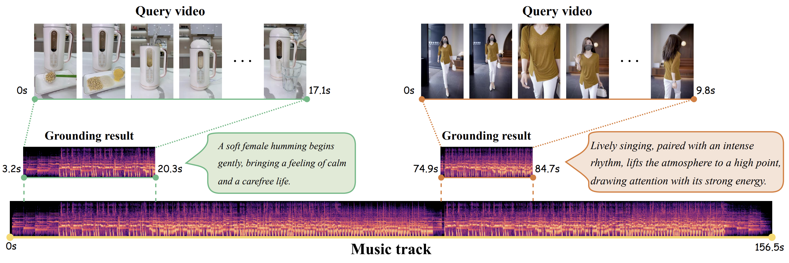

# Music Grounding by Short Video

The official source code of our ICCV25 paper "[Music Grounding by Short Video](https://arxiv.org/abs/2408.16990)".




## 👀 Introduction
This repository contains the official implementation of our paper, including training and evaluation scripts for the MGSV task.

## 🔧 Dependencies and Installation
We used Anaconda to setup a deep learning workspace that supports PyTorch. Run the following script to install all the required packages.

```shell
# git clone this repository
git clone https://github.com/xxayt/MGSV.git
cd MGSV

# create a new anaconda env
conda create -n MGSV_env python=3.8
conda activate MGSV_env

# install torch and dependencies
pip install -r requirements.txt
```
## 📦 Data

#### 📥 Data download

Please refer to the guides from [huggingface](https://huggingface.co/datasets/xxayt/MGSV-EC) for downloading the dataset MGSV-EC.

#### 📥 Encoder Download (Optional)

- AST Encoder: Download the AST model `audioset_0.4593.pth` from [Dropbox](https://www.dropbox.com/s/cv4knew8mvbrnvq/audioset_0.4593.pth?dl=1). This model follows the implementation in the [AST repo](https://github.com/YuanGongND/ast) and can be used for audio feature extraction. You can also explore the [](https://colab.research.google.com/github/YuanGongND/ast/blob/master/colab/AST_Inference_Demo.ipynb) for hands-on usage.

- CLIP Encoder: Download the CLIP model `ViT-B-32.pt` from [this link](https://openaipublic.azureedge.net/clip/models/40d365715913c9da98579312b702a82c18be219cc2a73407c4526f58eba950af/ViT-B-32.pt).
This model follows the implementation in the [CLIP repo](https://github.com/openai/CLIP), specifically [clip.py](https://github.com/openai/CLIP/blob/main/clip/clip.py#L36), for visual feature extraction.

#### 🗂️ Files organization

After downloading the dataset and encoder model, organize the files as follows:
```shell
.
├── dataset
│   └── MGSV-EC
│       ├── train_data.csv
│       ├── val_data.csv
│       └── test_data.csv
├── features
│   └── Kuai_feature
│       ├── ast_feature2p5/
│       └── vit_feature1/
├── model
│   ├── ...
│   └── pretrained_models
│       ├── audioset_0.4593.pth
│       └── ViT-B-32.pt
└── README.md
```


## 🚀 How to Run

#### Training

We provide a demo training script. To train MaDe on a specified GPU, use the following command:

```shell
bash scripts/train_kuai_all_feature.sh
```

Make sure to modify the data path, save path, and set the GPU for training. This process can be done using a single GPU.

#### Evaluation

To evaluate the model on the test set, use the following command:

```shell
bash scripts/test_kuai_all_feature.sh
```

Ensure that you update the script with the weight path `--load_uni_model_path` obtained from the training phase.


## 🤝 Acknowledgement
This implementation relies on resources from [AST](https://github.com/YuanGongND/ast), [DETR](https://github.com/facebookresearch/detr), [Moment-DETR](https://github.com/jayleicn/moment_detr), [CLIP4Clip](https://github.com/ArrowLuo/CLIP4Clip), [X-Pool](https://github.com/layer6ai-labs/xpool) and [UT-CMVMR](https://github.com/TencentARC-QQ/UT-CMVMR). We thank the original authors for their excellent contributions and for making their work publicly available.


## ✏️ Citation

If you find this work useful, please consider cite this paper:

```bibtex
@inproceedings{xin2025mgsv,
  title={Music Grounding by Short Video},
  author={Xin, Zijie and Wang, Minquan and Liu, Jingyu and Chen, Quan and Ma, Ye and Jiang, Peng and Li, Xirong},
  booktitle={Proceedings of the IEEE/CVF International Conference on Computer Vision},
  year={2025}
}
```


## 📜 License

The *MGSV-EC* dataset is under **[CC BY-NC-ND 4.0](https://creativecommons.org/licenses/by-nc-nd/4.0/)** license, see [DATA-LICENSE](./DATA-LICENSE). All the codes are under **[MIT](https://opensource.org/licenses/MIT)** license, see [LICENSE](./LICENSE). For commercial licensing or any use beyond research, please contact the authors.

#### 📥 Raw Vidoes/Music-tracks Access

The raw video and music files are not publicly available due to copyright and privacy constraints.  
Researchers interested in obtaining the full media content can contact **Kuaishou Technology** at: [wangminquan@kuaishou.com](mailto:wangminquan@kuaishou.com).

#### 📬 Contact for Issues

For any questions about this project (e.g., corrupted files or loading errors), please reach out at: [xinzijie@ruc.edu.cn](mailto:xinzijie@ruc.edu.cn)